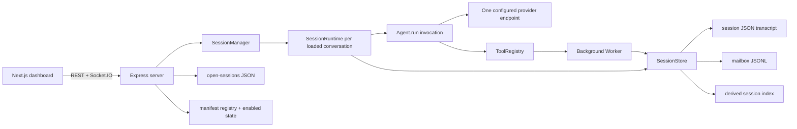

# Current architecture

This document describes behavior verified against source and tests. It treats code and passing checks as implementation evidence. `README.md`, `docs/ARCHITECTURE_DECISIONS.md`, and feature specifications may also contain target intent; those claims are called out rather than silently promoted to current behavior.

## Executed application path

The live path is `chatRouter` → `SessionManager.getOrCreate()` → `SessionRuntime.deliver()` → `Agent.run()`, with delegation added as a registered tool. The superseded polling `Orchestrator` implementation has been removed.

## Package responsibilities

### Core

- [`Agent.run`](../../packages/core/src/agent/agent.ts) owns one in-memory model/tool loop. It builds tools from an `AgentConfig`, appends structurally balanced assistant/tool messages even when a budget stops execution, projects bounded tool content into provider context and transient tool events, and propagates its deadline/cancellation signal into providers and tools before returning after stop or `maxSteps`.
- [`SessionRuntime`](../../packages/core/src/agent/session-runtime.ts) owns serialized delivery for one top-level `sessionId`. `deliver()` chains runs on an in-memory promise queue; `runOnce()` loads history, materializes unacknowledged worker completions, persists the canonical model order, acknowledges those completions, runs an agent, and persists success or the latest partial audit record.
- [`createDelegateTool`](../../packages/core/src/agent/delegation.ts) creates a task ID, derives a synthetic worker config from the delegating agent, persists a `worker-<taskId>` session, launches a `Worker` without awaiting it, persists progress/final state, and appends a completion to the parent mailbox.
- [`Worker.run`](../../packages/core/src/agent/worker.ts) wraps an `Agent` invocation, retains each progressive step, and maps cancellation/errors to a `WorkerResult`. Terminal delivery and cleanup are owned by the delegate/server lifecycle rather than duplicated into a process-local result queue.
- [`SessionStore`](../../packages/core/src/persistence/session.ts) is the file-I/O owner for transcripts and mailboxes. Transcripts use serialized latest-snapshot writes with temp-file rename; mailboxes use serialized append-only JSONL plus atomic acknowledgement rewrites. A transcript is durable before its derived index is updated. Collection scans preserve invalid bytes, retain healthy records, and return content-free diagnostics.
- [`IndexHandle`](../../packages/core/src/persistence/session-index.ts) maintains a derived `.index.json` projection used by the top-level session collection endpoints. Worker sessions are excluded by the `worker-` name convention.
- [`ToolRegistry`](../../packages/core/src/tool/registry.ts), file/shell/web tools, [`InboxManager`](../../packages/core/src/presentation/inbox.ts), agent-config loading, settings, capability discovery, plugin schemas, collaboration primitives, and TTS are reusable library surfaces.

### Server

- [`SessionManager`](../../packages/server/src/session-manager.ts) owns loaded `SessionRuntime` objects and running worker `AbortController` objects in process memory. It builds the concrete tool registry and relays runtime events to Socket.IO.
- [`chatRouter`](../../packages/server/src/routes/chat.ts) validates a message, aborts the delivery when its client disconnects, awaits a full `SessionRuntime.deliver()`, and only then slices the complete final summary into SSE-shaped chunks. An explicit retry is routed through `SessionRuntime.retry()`, which requires a matching durable user message and replays it without appending a duplicate transcript record. This is response chunking, not live model token streaming.
- [`sessionsRouter`](../../packages/server/src/routes/sessions.ts) owns session CRUD, metadata-only collection listing, safe durable-record diagnostics, rename, conditional mailbox wake on explicit open, updates to the open-session registry, and close/delete lifecycle enforcement.
- [`open-sessions.ts`](../../packages/server/src/open-sessions.ts) persists the browser tab set and active tab atomically under `.harness/open-sessions.json`; duplicate IDs and active IDs outside the open set are rejected. An explicit update quarantines malformed prior bytes before repair. Settings use the same quarantine-on-repair policy, while `ROOT` remains environment/discovery-owned.
- [`PluginRegistry`](../../packages/server/src/plugin/registry.ts) recursively rescans sorted manifest files when listed, rejects duplicate names deterministically, preserves invalid state for diagnosis, and repairs it through an explicit toggle. [`pluginsRouter`](../../packages/server/src/routes/plugins.ts) exposes list/toggle operations.
- [`HookBus`](../../packages/server/src/hooks.ts) defines before middleware and after observers. Session close and delete await veto-capable before middleware before durable or runtime state changes.
- [`ws/events.ts`](../../packages/server/src/ws/events.ts) broadcasts agent start/completion/error/tool, worker spawn/completion, and full session updates.

### Dashboard

- [`RuntimeSync`](../../packages/dashboard/src/components/chat/RuntimeSync.tsx) hydrates the server-owned open-tab snapshot as history, repairs it when a durable session cannot be restored, mirrors later tab changes back to the server, and consumes Socket.IO runtime events.
- [`useSessionStore`](../../packages/dashboard/src/stores/session-store.ts) is a browser projection of transcripts and tab selection. Server session updates replace its message projection.
- [`useRuntimeStore`](../../packages/dashboard/src/stores/runtime-store.ts) and [`useRosterStore`](../../packages/dashboard/src/stores/agent-roster-store.ts) hold bounded transient activity/running/worker UI state. They are not reconstructed from durable worker execution state on boot.
- [`usePluginStore`](../../packages/dashboard/src/stores/plugin-store.ts) builds enabled renderer and command indexes from the server registry.
- [`plugins/registry.ts`](../../packages/dashboard/src/plugins/registry.ts) statically imports a fixed set of built-in renderer components, while [`InboxItemView`](../../packages/dashboard/src/components/inbox/InboxItemView.tsx) selects among them using manifest metadata.
- [`lib/api.ts`](../../packages/dashboard/src/lib/api.ts) is the REST adapter and applies endpoint-specific response budgets for durable sessions and inbox files, including JSON/base64 expansion. [`lib/ws.ts`](../../packages/dashboard/src/lib/ws.ts) is the Socket.IO adapter.

## Observability and correlation

A shared structured logger (`core/contracts/logging.ts`) and error normalizer (`core/contracts/errors.ts`) are used by core, server, and dashboard (ADR 0003). `SessionRuntime.runOnce` generates an ephemeral `runId` per execution attempt, and the chat route generates an optional `requestId` at the HTTP edge. Both are threaded into logs via child loggers and onto `agent:started`/`agent:completed`/`agent:error`/`agent:tool` WebSocket events (`runId`/`requestId`, plus `code` on errors). They are correlation context, not durable transcript fields. `/api/health` and `/api/metrics` remain the exposure points for process health and limiter state; metrics histograms, distributed tracing, and an administrative audit trail (which requires an authenticated actor) are not implemented.

## Implemented lifecycle

1. The dashboard creates or selects a top-level session and sends `{sessionId, message, agentName}` to `/api/chat`.
2. `SessionManager` creates an in-memory runtime on first execution. Merely hydrating history does not create a runtime.
3. `SessionRuntime` serializes deliveries, peeks all durable completions, deduplicates by `taskId`, persists completion system messages before the new user message, then acknowledges the peeked records. Recovery after a failure between those writes sees the durable transcript identity and does not duplicate delivery.
4. `Agent.run()` calls the configured model and registered tools until stop, cancellation, or the step limit.
5. Delegation returns immediately from the tool call with `taskId` and `workerSessionId`; the worker continues in the server process.
6. Worker progress and final transcript snapshots use the same `SessionData` shape as user sessions. Final delivery is separately appended to the parent mailbox.
7. If the parent runtime is loaded, `SessionManager.onWorkerCompleted()` starts a mailbox-only wake run. The delegate tool is removed for this wake to prevent autonomous re-delegation. If no runtime is loaded, delivery stays on disk until an explicit open or later message drains it.

Mailbox and transcript are still separate files rather than one transaction. The recovery protocol is materialize-before-acknowledge: failure before transcript persistence leaves the mailbox intact, while failure after transcript persistence leaves a replayable record whose `taskId` is already represented in the transcript. Concurrent appends are preserved by the mailbox write queue and acknowledgement rewrite.

## Persistence and ownership

| State | Current owner | Durability | Important limitation |
|---|---|---|---|
| Agent definition | Markdown in `agents/`, CRUD via server | File-backed | Name is the effective identity; no schema version or immutable ID. |
| Top-level transcript | `SessionStore` | Atomic JSON snapshot | The same schema also represents worker executions; invalid records remain in place and are omitted with safe diagnostics during collection scans. |
| Worker completion | `SessionStore` mailbox | Ordered JSONL until acknowledgement | Delivery identity and replay deduplication use `taskId`; there is no independently versioned delivery-event ID. |
| Session list metadata | `IndexHandle` | Rebuildable JSON projection | Eventually consistent by design. |
| Open/active tabs | Server `open-sessions.ts` | Atomic JSON snapshot | Browser is the writer; closing unloads its runtime after before-close hooks pass. Invalid bytes are quarantined only on an explicit repair update. |
| Loaded runtime | `SessionManager.runtimes` | Process memory | Not recovered; plain boot hydration does not wake pending mailboxes. |
| Running worker/cancel handle | `SessionManager.workerControllers` | Process memory | Lost on server restart; no resume/reconciliation path. |
| Plugin enabled state | Server `PluginRegistry` | JSON snapshot | Registry has no filesystem watcher or plugin-change event. |
| Dashboard runtime/roster state | Zustand stores | Browser memory | History sync does not rebuild the running-worker roster. |

The single-writer and atomicity guarantees in `SessionStore` coordinate callers inside one Node process. They are not a multi-process lock or transactional database guarantee.

## Implemented, partial, and intent-only claims

| Capability | Status | Evidence |
|---|---|---|
| Durable conversations and worker transcripts | Implemented | `SessionStore`, `SessionRuntime`, session routes. |
| Durable worker-result delivery | Implemented with recovery gaps | Mailbox JSONL, conditional wake, and wake-run guard are wired; running workers and runtimes are not restartable. |
| File-based agent configs and dashboard CRUD | Implemented | `config-loader.ts`, `routes/agents.ts`, dashboard agent editor. |
| Per-conversation agent selection | Partial | The browser picker updates Zustand immediately; the server persists `agentName` only when a later chat delivery includes it. |
| Inbox filesystem UI and built-in renderers | Implemented | `InboxManager`, inbox routes/components, manifest-selected static renderers. |
| Server-discovered plugin manifests | Partial | Inbox-renderer and command metadata plus enable flags exist. Components remain statically imported; no arbitrary runtime module loading. |
| Plugin pages, chat cards, settings panels, tools, skills | Intent only | They are described in architecture prose but absent from `PluginManifestSchema`. |
| Plugin hot reload | Not implemented | No watcher, reload endpoint, or plugin-change WebSocket event exists. A later GET rescans manifests only. |
| Multi-provider support | Partial | One endpoint/key setting is used. A hard-coded model-name set chooses Anthropic format; every other model uses OpenAI chat format. There is no provider registry or per-agent endpoint. |
| Four-tier capability discovery | Library present, execution integration absent | `CapabilityRegistry.lookup()` exists, but the active `Agent` path does not call it. |
| Max concurrent agents | Implemented | A process-wide FIFO `ExecutionLimiter` bounds parent and worker model executions, removes canceled waiters without consuming capacity, rejects work beyond a bounded wait queue, updates from `MAX_CONCURRENT_AGENTS`, and exposes active/queued counts through `/api/metrics`. |
| Recursive delegation | Deliberately disabled | Workers no longer inherit the parent-bound `delegate` tool. Proper recursive delegation remains a future session-scoped design rather than misattributing nested work. |
| Live streaming | Partial | Socket events expose steps/tools; `/api/chat` waits for completion and then emits synthetic text chunks. |
| Worker history after reconnect | Partial | Worker transcripts persist, but the browser roster is live-event-only and is not rebuilt on hydration. |
| Councils and supervision | Library/UI remnants only | Core primitives and dashboard card types exist, but the server runtime does not create councils or emit council events. |
| Skills, prompt templates, branching, compaction, context-file loading | Intent only | No product runtime implementation or public contract exists. `.agents/skills` is development tooling only. |

## Verification reality

The root Vitest project matrix includes core, server, dashboard, and repository-tooling projects. The tooling project tests executable TypeScript, trust-boundary, workflow supply-chain, and dependency-audit policies with negative fixtures. Production and test sources are both typechecked under strict mode. Coverage includes:

- malformed persisted configuration, read-only root ownership, and quarantine-on-repair behavior;
- valid and invalid session transcript/mailbox records, including byte preservation, content-free diagnostics, and healthy-record listing;
- provider-supplied tool argument validation before execution;
- stable server request-validation errors and path-like identifier rejection;
- dashboard HTTP, chat-stream, and WebSocket payload validation.
- per-session delivery serialization, ordered atomic mailbox drain, wake-run delegation suppression, worker completion, provider/tool/client-disconnect cancellation, and post-run completion timestamps;
- process-wide concurrency and abortable queue limits, tool-call, provider-context tool-result, provider-output, reported-or-estimated total-token, and wall-time budgets while durable tool results remain verbatim;
- bounded provider/browser response parsing, workspace file/search limits, time-bounded regex execution, symlink-aware path containment, subprocess environment minimization, public-only pinned outbound connections, redirect revalidation, loopback binding, CORS, and stable malformed/oversized/internal error envelopes;
- dependency-audit package/advisory exceptions and their expiry behavior;
- plugin discovery/state persistence, capability probing, inbox metadata mutations, bounded file I/O, provider response envelopes, and rejected async Express handler propagation.

[`packages/core/test/integration.ts`](../../packages/core/test/integration.ts) remains a manual console script, not part of the configured Vitest suite. Provider routing and broad end-to-end dashboard resynchronization remain less covered than focused boundary and projection behavior; those gaps remain visible rather than being hidden by the global percentage.

`corepack npm run test:coverage` uses the V8 provider across the same projects and writes text, HTML, and LCOV output. Conservative global thresholds of 24/18/19/26 prevent regression; critical modules have focused tests, while the lower UI and adapter totals are not presented as broad product protection. Current measurements belong in CI or the pull request that changes them rather than in this durable architecture map.

`corepack npm run quality:policy` resolves every repository TypeScript configuration and rejects disabled strictness, individually weakened strict options, TypeScript suppression directives, explicit `any`, type and non-null assertions other than `as const`, unwrapped async Express routes, direct Express request-data use outside `validateRequest`, raw boundary JSON parsing, unbounded HTTP JSON parsing, mutable GitHub Action tags, and Node/runtime imports from the browser-safe core contracts surface. Core session/config/cache data, server request bodies/params/query, plugin state, provider responses, dashboard HTTP/chat-stream/WebSocket responses, and local TTS settings now have explicit schemas. Dashboard code consumes those schemas through `@agent-harness/core/contracts`, which cannot import the Node-backed core runtime.

Privileged operations are default-off or application-bounded: shell and network tools require explicit environment opt-in; enabled file/shell/network operations have symlink-aware authorization, byte/time/entry limits, credential-minimized subprocesses, time-bounded regex evaluation, and validated-address connection pinning with redirect revalidation. The server is loopback-only by default, uses an origin allowlist and stable error envelopes, and enforces deterministic execution/resource budgets. `corepack npm run security:audit` rejects high or critical production findings unless an explicit exception identifies the affected package and advisory with a reason and future expiry. Performance reporting remains informational rather than a portable timing gate. These controls do not claim process isolation; residual risks are documented in [`docs/SECURITY.md`](../SECURITY.md).

## Immediate architecture risks

1. The overloaded `SessionData`/`taskId` vocabulary makes future persistence changes ambiguous and migration-prone.
2. Mailbox acknowledgement and transcript materialization remain separate writes. Task-based replay is lossless for current worker completions, but there is no schema-versioned delivery-event identity for future event types.
3. Durable delivery is stronger than worker execution recovery after append: an in-flight worker disappears on restart with no terminal reconciliation.
4. Boot hydration repairs missing open sessions, but it restores ordinary tabs as history only; a pending mailbox is woken only through the explicit open endpoint or a later message.
5. Capability discovery is present but not integrated into active execution, and provider routing remains a hard-coded protocol choice rather than a registry.
6. CORS and loopback binding are not authentication or process isolation; deliberately exposed deployments need an authenticating reverse proxy and OS/network containment.
7. Provider routing, dashboard resynchronization, and broad UI behavior remain substantially less tested than the critical agent/persistence path.
