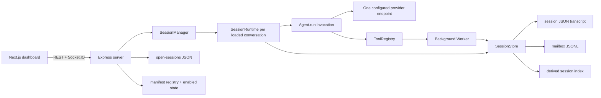

# Current architecture

This document describes source inspected on 2026-08-10. It treats code and passing tests as implementation evidence. `README.md`, `docs/ARCHITECTURE_DECISIONS.md`, and feature specs still contain intent that is not wired into the current application; those claims are called out rather than silently promoted to current behavior.

## Executed application path

The server does **not** instantiate the exported `Orchestrator` class. The live path is `chatRouter` → `SessionManager.getOrCreate()` → `SessionRuntime.deliver()` → `Agent.run()`, with delegation added as a registered tool.

## Package responsibilities

### Core

- [`Agent.run`](../../packages/core/src/agent/agent.ts) owns one in-memory model/tool loop. It builds tools from an `AgentConfig`, appends assistant and tool messages, checks an abort signal between steps and tool calls, and returns after stop or `maxSteps`.
- [`SessionRuntime`](../../packages/core/src/agent/session-runtime.ts) owns serialized delivery for one top-level `sessionId`. `deliver()` chains runs on an in-memory promise queue; `runOnce()` loads history, persists a user message, drains worker completions, runs an agent, and persists the appended record.
- [`createDelegateTool`](../../packages/core/src/agent/delegation.ts) creates a task ID, derives a synthetic worker config from the delegating agent, persists a `worker-<taskId>` session, launches a `Worker` without awaiting it, persists progress/final state, and appends a completion to the parent mailbox.
- [`Worker.run`](../../packages/core/src/agent/worker.ts) wraps an `Agent` invocation, maps cancellation/errors to a `WorkerResult`, and also posts to the process-local `MessageBus`.
- [`SessionStore`](../../packages/core/src/persistence/session.ts) is the file-I/O owner for transcripts and mailboxes. Transcripts use serialized latest-snapshot writes with temp-file rename; mailboxes use serialized append-only JSONL and whole-queue drain.
- [`IndexHandle`](../../packages/core/src/persistence/session-index.ts) maintains a derived `.index.json` projection for top-level session listing. Worker sessions are excluded by the `worker-` name convention.
- [`ToolRegistry`](../../packages/core/src/tool/registry.ts), file/shell/web tools, [`InboxManager`](../../packages/core/src/presentation/inbox.ts), agent-config loading, settings, capability discovery, plugin schemas, collaboration primitives, and TTS are reusable library surfaces.

### Server

- [`SessionManager`](../../packages/server/src/session-manager.ts) owns loaded `SessionRuntime` objects and running worker `AbortController` objects in process memory. It builds the concrete tool registry and relays runtime events to Socket.IO.
- [`chatRouter`](../../packages/server/src/routes/chat.ts) validates a message, awaits a full `SessionRuntime.deliver()`, and only then slices the final summary into SSE-shaped chunks. This is response chunking, not live model token streaming.
- [`sessionsRouter`](../../packages/server/src/routes/sessions.ts) owns session CRUD, metadata listing, rename, conditional mailbox wake on explicit open, and updates to the open-session registry.
- [`open-sessions.ts`](../../packages/server/src/open-sessions.ts) persists the browser tab set and active tab atomically under `.harness/open-sessions.json`.
- [`PluginRegistry`](../../packages/server/src/plugin/registry.ts) recursively rescans manifest files when listed and persists enabled flags. [`pluginsRouter`](../../packages/server/src/routes/plugins.ts) exposes list/toggle operations.
- [`HookBus`](../../packages/server/src/hooks.ts) defines before middleware and after observers. Current routes emit after-events for session lifecycle; no production registration of before middleware was found.
- [`ws/events.ts`](../../packages/server/src/ws/events.ts) broadcasts agent start/completion/error/tool, worker spawn/completion, and full session updates.

### Dashboard

- [`RuntimeSync`](../../packages/dashboard/src/components/chat/RuntimeSync.tsx) hydrates the server-owned open-tab snapshot as history, mirrors tab changes back to the server, and consumes Socket.IO runtime events.
- [`useSessionStore`](../../packages/dashboard/src/stores/session-store.ts) is a browser projection of transcripts and tab selection. Server session updates replace its message projection.
- [`useRuntimeStore`](../../packages/dashboard/src/stores/runtime-store.ts) and [`useRosterStore`](../../packages/dashboard/src/stores/agent-roster-store.ts) hold transient activity/running/worker UI state. They are not reconstructed from durable worker execution state on boot.
- [`usePluginStore`](../../packages/dashboard/src/stores/plugin-store.ts) builds enabled renderer and command indexes from the server registry.
- [`plugins/registry.ts`](../../packages/dashboard/src/plugins/registry.ts) statically imports a fixed set of built-in renderer components, while [`InboxItemView`](../../packages/dashboard/src/components/inbox/InboxItemView.tsx) selects among them using manifest metadata.
- [`lib/api.ts`](../../packages/dashboard/src/lib/api.ts) is the REST adapter and [`lib/ws.ts`](../../packages/dashboard/src/lib/ws.ts) is the Socket.IO adapter.

## Implemented lifecycle

1. The dashboard creates or selects a top-level session and sends `{sessionId, message, agentName}` to `/api/chat`.
2. `SessionManager` creates an in-memory runtime on first execution. Merely hydrating history does not create a runtime.
3. `SessionRuntime` serializes deliveries for that runtime, persists the user message, drains all durable completions, and materializes each completion as a system transcript message with `meta.kind = "worker_completed"`.
4. `Agent.run()` calls the configured model and registered tools until stop, cancellation, or the step limit.
5. Delegation returns immediately from the tool call with `taskId` and `workerSessionId`; the worker continues in the server process.
6. Worker progress and final transcript snapshots use the same `SessionData` shape as user sessions. Final delivery is separately appended to the parent mailbox.
7. If the parent runtime is loaded, `SessionManager.onWorkerCompleted()` starts a mailbox-only wake run. The delegate tool is removed for this wake to prevent autonomous re-delegation. If no runtime is loaded, delivery stays on disk until an explicit open or later message drains it.

`MailboxLog.drain()` serializes and removes one whole in-process batch, but the end-to-end handoff is not crash-atomic: the mailbox file is truncated before `SessionRuntime` saves the corresponding system messages into the transcript. A process failure in that interval can lose the only durable copy of a completion.

## Persistence and ownership

| State | Current owner | Durability | Important limitation |
|---|---|---|---|
| Agent definition | Markdown in `agents/`, CRUD via server | File-backed | Name is the effective identity; no schema version or immutable ID. |
| Top-level transcript | `SessionStore` | Atomic JSON snapshot | The same schema also represents worker executions. |
| Worker completion | `SessionStore` mailbox | Ordered JSONL until drain | Delivery identity is `taskId`; no explicit acknowledgement or replay ledger. |
| Session list metadata | `IndexHandle` | Rebuildable JSON projection | Eventually consistent by design. |
| Open/active tabs | Server `open-sessions.ts` | Atomic JSON snapshot | Browser is the writer; closing a tab does not call `SessionManager.unload()`. |
| Loaded runtime | `SessionManager.runtimes` | Process memory | Not recovered; plain boot hydration does not wake pending mailboxes. |
| Running worker/cancel handle | `SessionManager.workerControllers` | Process memory | Lost on server restart; no resume/reconciliation path. |
| Plugin enabled state | Server `PluginRegistry` | JSON snapshot | Registry has no filesystem watcher or plugin-change event. |
| Dashboard runtime/roster state | Zustand stores | Browser memory | History sync does not rebuild the running-worker roster. |

The single-writer and atomicity guarantees in `SessionStore` coordinate callers inside one Node process. They are not a multi-process lock or transactional database guarantee.

## Implemented, partial, and intent-only claims

| Capability | Status | Evidence |
|---|---|---|
| Durable conversations and worker transcripts | Implemented | `SessionStore`, `SessionRuntime`, session routes. |
| Durable worker-result delivery | Implemented with recovery gaps | Mailbox JSONL, conditional wake, and wake-run guard are wired; running workers and runtimes are not restartable. |
| File-based agent configs and dashboard CRUD | Implemented | `config-loader.ts`, `routes/agents.ts`, dashboard agent editor. |
| Per-conversation agent selection | Partial | The browser picker updates Zustand immediately; the server persists `agentName` only when a later chat delivery includes it. |
| Inbox filesystem UI and built-in renderers | Implemented | `InboxManager`, inbox routes/components, manifest-selected static renderers. |
| Server-discovered plugin manifests | Partial | Inbox-renderer and command metadata plus enable flags exist. Components remain statically imported; no arbitrary runtime module loading. |
| Plugin pages, chat cards, settings panels, tools, skills | Intent only | They are described in architecture prose but absent from `PluginManifestSchema`. |
| Plugin hot reload | Not implemented | No watcher, reload endpoint, or plugin-change WebSocket event exists. A later GET rescans manifests only. |
| Multi-provider support | Partial | One endpoint/key setting is used. A hard-coded model-name set chooses Anthropic format; every other model uses OpenAI chat format. There is no provider registry or per-agent endpoint. |
| Four-tier capability discovery | Library present, execution integration absent | `CapabilityRegistry.lookup()` exists, but the active `Agent` path does not call it. |
| Max concurrent agents | Configuration only | `MAX_CONCURRENT_AGENTS` is parsed and editable but not used by `SessionManager` or delegation. |
| Recursive delegation | Incorrectly bound | Workers inherit the `delegate` tool, but share the parent registry whose delegate closure retains the original parent `sessionId`; nested work is attributed/delivered to that original parent. |
| Live streaming | Partial | Socket events expose steps/tools; `/api/chat` waits for completion and then emits synthetic text chunks. |
| Worker history after reconnect | Partial | Worker transcripts persist, but the browser roster is live-event-only and is not rebuilt on hydration. |
| Councils and supervision | Library/UI remnants only | Core primitives and dashboard card types exist, but the server runtime does not create councils or emit council events. |
| Exported `Orchestrator` class | Not the server runtime | It remains exported but is not imported by the server. Its polling inbox path differs from `SessionRuntime`'s durable mailbox path. |
| Skills, prompt templates, branching, compaction, context-file loading | Intent only | No product runtime implementation or public contract exists. `.agents/skills` is development tooling only. |

## Verification reality

The normal Vitest run currently discovers four test files and eight tests:

- core configuration parsing/defaults: three tests;
- server health route: one test;
- dashboard command-palette store: two tests;
- dashboard error boundary: two tests.

[`packages/core/test/integration.ts`](../../packages/core/test/integration.ts) is a manual console script, not part of the configured Vitest suite. There are no automated tests for `SessionStore`, mailbox ordering/drain, `SessionRuntime`, delegation/wake behavior, cancellation, session routes, plugin discovery, provider routing, or dashboard resynchronization. The current build and typecheck are green, but the highest-value runtime invariants are largely protected by prose rather than executable evidence.

## Immediate architecture risks

1. The overloaded `SessionData`/`taskId` vocabulary makes future persistence changes ambiguous and migration-prone.
2. Mailbox drain and transcript materialization are separate writes, leaving a completion-loss crash window and no durable acknowledgement/idempotency ledger.
3. Durable delivery is stronger than worker execution recovery after append: an in-flight worker disappears on restart with no terminal reconciliation.
4. Recursive delegation is not session-scoped because a worker reuses its parent's bound tool registry.
5. Boot hydration restores tabs as history only, so an already-open session with a pending mailbox is not automatically woken after a server/browser restart.
6. Settings and documentation expose behavior that is not enforced or integrated, especially concurrency and capability discovery.
7. The sparse test suite makes it easy to regress transcript fidelity, mailbox delivery, and runtime ownership while attempting unrelated features.
