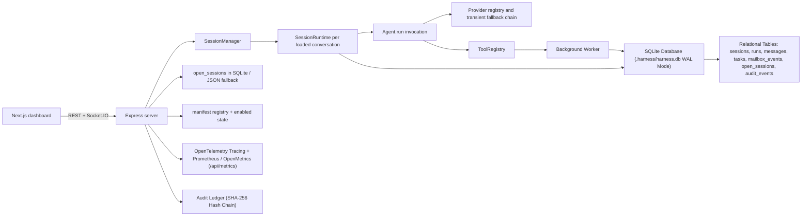

# Current architecture

This document describes behavior verified against source and tests. It treats code and passing checks as implementation evidence. `README.md`, `docs/ARCHITECTURE_DECISIONS.md`, and feature specifications may also contain target intent; those claims are called out rather than silently promoted to current behavior.

## Executed application path

The live path is `chatRouter` → `SessionManager.getOrCreate()` → `SessionRuntime.deliver()` → `Agent.run()`, with delegation added as a registered tool. The superseded polling `Orchestrator` implementation has been removed.

## Package responsibilities

### Core

- [`Agent.run`](../../packages/core/src/agent/agent.ts) owns one in-memory model/tool loop. It builds tools from an `AgentConfig`, appends structurally balanced assistant/tool messages even when a budget stops execution, projects bounded tool content into provider context and transient tool events, wraps `agent.step` and `tool.execute` spans in deterministic `try ... finally` blocks, and propagates its deadline/cancellation signal into providers and tools before returning after stop or `maxSteps`.
- [`SessionRuntime`](../../packages/core/src/agent/session-runtime.ts) owns serialized delivery for one top-level `sessionId`. `deliver()` chains runs on an in-memory promise queue; `runOnce()` executes an atomic `BEGIN IMMEDIATE` SQLite transaction to load history, materialize unacknowledged worker completions with monotonic message sequence numbers, persist the canonical model order, acknowledge mailbox events, and insert run tracking records before executing the agent loop. Each execution resolves one capability matrix and shares it with context preparation and `Agent.run()`. Before the primary provider call it can replace the oldest contiguous active range with a derived compaction summary when the configured context threshold is exceeded. `persistRunCompletion()` deduplicates message persistence and run completion status updates across success, error, and cancellation paths while merging compaction and streaming usage subtrees.
- [`Compactor`](../../packages/core/src/agent/compactor.ts) performs one signal-aware, output-bounded provider call with the agent model and preferred provider over a deterministic bounded projection that excludes persisted assistant reasoning, requesting a structured semantic-memory block and chronological summary. Only non-empty, normally stopped, tool-free responses are accepted. The minimum positive discovered/configured `capabilities.contextWindowTokens` controls the threshold independently from provider/output generation limits. Original messages remain canonical; tool-call/result groups are never split, `MessageRepository.getActiveContext()` substitutes summaries only in model context, and it has no 10,000-row listing cap. Compaction provider usage, including rejected-response usage, is stored separately under `runs.token_usage.compactionTokenUsage` and coexists with streaming metrics.
- [`SqliteDatabaseDriver`](../../packages/core/src/persistence/sqlite/db.ts) and [`SqliteMigrator`](../../packages/core/src/persistence/sqlite/migrator.ts) manage embedded SQLite with Write-Ahead Logging (WAL) mode, busy timeouts, and SHA-256 verified schema migrations (including `001_initial_schema.sql`, `002_audit_events.sql`, and `003_compaction_records.sql`).
- Strongly typed relational repositories ([`SessionRepository`](../../packages/core/src/persistence/sqlite/session-repo.ts), [`RunRepository`](../../packages/core/src/persistence/sqlite/run-repo.ts), [`MessageRepository`](../../packages/core/src/persistence/sqlite/message-repo.ts), [`TaskRepository`](../../packages/core/src/persistence/sqlite/task-repo.ts), [`MailboxRepository`](../../packages/core/src/persistence/sqlite/mailbox-repo.ts), [`OpenSessionsRepository`](../../packages/core/src/persistence/sqlite/open-sessions-repo.ts), [`AuditRepository`](../../packages/core/src/persistence/sqlite/audit-repo.ts)) enforce relational integrity, monotonic sequence numbers, cascade deletions, and tamper-evident append-only audit ledgers.
- [`AuditRepository`](../../packages/core/src/persistence/sqlite/audit-repo.ts) records hash-chained audit events computed via RFC 8785 Canonical JSON (`canonical-json.ts`) and SHA-256 (`audit-hash.ts`) with automatic sensitive field/secret redaction (`redaction.ts`).
- [`W3CTraceContext`](../../packages/core/src/contracts/tracing.ts) provides W3C Trace Context parsing, serialization, and validation with `W3CTraceParentSchema` rejecting all-zero trace and span identifiers.
- [`ITracer`](../../packages/core/src/telemetry/spans.ts) defines framework-neutral distributed tracing contracts with `NoopTracer` fallback.
- [`LegacyMigrator`](../../packages/core/src/persistence/sqlite/legacy-migrator.ts) imports legacy JSON transcripts, mailbox JSONL, and open-sessions state into SQLite with pre-migration backups and corrupted file quarantine (`.invalid-*`).
- [`createDelegateTool`](../../packages/core/src/agent/delegation.ts) creates a task ID, tracks worker tasks in `tasks` table, launches a `Worker` without awaiting it, and enqueues completion events to `mailbox_events`.
- [`Worker.run`](../../packages/core/src/agent/worker.ts) wraps an `Agent` invocation, retains each progressive step, and maps cancellation/errors to a `WorkerResult`. Terminal delivery and cleanup are owned by the delegate/server lifecycle rather than duplicated into a process-local result queue.
- [`SessionStore`](../../packages/core/src/persistence/session.ts) provides file-I/O backward compatibility for transcripts and mailboxes.
- [`ToolRegistry`](../../packages/core/src/tool/registry.ts), file/shell/web tools, [`InboxManager`](../../packages/core/src/presentation/inbox.ts), agent-config loading, settings, capability discovery, plugin schemas, collaboration primitives, and TTS are reusable library surfaces.

### Server

- [`SessionManager`](../../packages/server/src/session-manager.ts) owns loaded `SessionRuntime` objects, SQLite connection lifecycle, audit logging for administrative actions and tool executions (`tool.exec.*`), and running worker `AbortController` objects. Its awaited close path aborts active work, waits for terminal cleanup, clears runtime/provider state, and then closes SQLite so reinitialization constructs a fresh provider generation. On boot, `SessionManager.initialize()` executes startup worker reconciliation, atomically transitioning each orphaned `running`/`queued` task to `abandoned` with its diagnostic mailbox event before emitting delivery notifications.
- [`ServerTracer`](../../packages/server/src/telemetry/tracer.ts) implements OpenTelemetry tracing via `AsyncLocalStorage` context propagation and `createBatchOtlpHttpExporter` with configurable batching thresholds and background timer flushes.
- [`MetricRegistry`](../../packages/server/src/telemetry/metrics.ts) and [`metricsRouter`](../../packages/server/src/routes/metrics.ts) expose Prometheus text, OpenMetrics (`# EOF\n` trailer), and JSON format snapshots for active/queued executions, token counters, and persisted/loaded session counts via `SessionRepository.count()`.
- [`chatRouter`](../../packages/server/src/routes/chat.ts) validates a message and optional client-generated UUID `deliveryId`, aborts delivery when its client disconnects, and forwards correlated live text and bounded tool-input deltas from [`SessionRuntime`](../../packages/core/src/agent/session-runtime.ts) as shared-schema SSE events. [`Agent`](../../packages/core/src/agent/agent.ts) incrementally bounds and assembles provider output before persistence; non-streaming agents retain bounded summary chunking. The dashboard reuses its optimistic user-message UUID as `deliveryId`; serialized retry replays only the durable user with that exact identity, persists the identity in both JSON and the existing SQLite message primary key, rejects identity/content conflicts, and treats a supplied but not-yet-durable identity as a fresh delivery. Legacy retry requests without `deliveryId` retain latest-user/content reconciliation for compatibility.
- [`sessionsRouter`](../../packages/server/src/routes/sessions.ts) owns session CRUD, metadata-only collection listing via indexed SQLite queries (<10ms for 10k sessions), safe durable-record diagnostics, rename, conditional mailbox wake on explicit open, updates to the open-session registry, and close/delete lifecycle enforcement. A session detail response includes compaction-range metadata, and the bounded `/:id/messages` endpoint retrieves canonical originals for expansion.
- [`open-sessions.ts`](../../packages/server/src/open-sessions.ts) persists the browser tab set and active tab under SQLite `open_sessions` and `.harness/open-sessions.json`; duplicate IDs and active IDs outside the open set are rejected. An explicit update quarantines malformed prior bytes before repair. Settings use the same quarantine-on-repair policy, while `ROOT` remains environment/discovery-owned.
- [`PluginRegistry`](../../packages/server/src/plugin/registry.ts) recursively rescans sorted manifest files when listed, rejects duplicate names deterministically, preserves invalid state for diagnosis, and repairs it through an explicit toggle. [`pluginsRouter`](../../packages/server/src/routes/plugins.ts) exposes list/toggle operations.
- [`HookBus`](../../packages/server/src/hooks.ts) defines before middleware and after observers. Session close and delete await veto-capable before middleware before durable or runtime state changes.
- [`ws/events.ts`](../../packages/server/src/ws/events.ts) broadcasts agent start/completion/error/tool, worker spawn/completion, and full session updates.

## Persistence and ownership

| State | Current owner | Durability | Important limitation |
|---|---|---|---|
| Agent definition | Markdown in `agents/`, CRUD via server | File-backed | Name is the effective identity; no schema version or immutable ID. |
| Relational Storage & Tables | SQLite `.harness/harness.db` (WAL) | ACID Transactions (`BEGIN IMMEDIATE`) | Single host embedded database. |
| Top-level transcript | `SessionRepository` / `MessageRepository` | Indexed relational messages with monotonic sequence IDs | Normalized in `messages` and `sessions` tables. |
| Active compacted context | `MessageRepository` / `compaction_records` | Derived summaries plus immutable, tool-exchange-safe source ranges | Originals remain in `messages`; constraints and triggers reject invalid, cross-session, duplicate, or overlapping ranges. Migration rollback removes referenced derived summaries while preserving canonical transcript rows. |
| Worker completion | `MailboxRepository` (`mailbox_events`) | Transactional drain inside `BEGIN IMMEDIATE` | Drains atomically with message materialization. |
| In-flight worker reconciliation | `SessionManager.initialize` | Reconciled to `abandoned` on boot | Diagnostic mailbox event delivered on parent wake. |
| Audit ledger | `AuditRepository` (`audit_events`) | SHA-256 hash-chained immutable append-only log | Verifiable via `scripts/verify-audit-log.mjs`. |
| Session list metadata | `SessionRepository.listMeta` | Relational B-tree index | Responds in < 10ms for 10,000 sessions. |
| Open/active tabs | `OpenSessionsRepository` (`open_sessions`) | Relational table + JSON snapshot | Browser is writer; closing unloads runtime after before-close hooks pass. |
| Loaded runtime | `SessionManager.runtimes` | Process memory | Boot reconciliation transitions orphaned tasks cleanly. |
| Plugin enabled state | Server `PluginRegistry` | JSON snapshot | Registry has no filesystem watcher or plugin-change event. |
| Dashboard runtime/roster state | Zustand stores | Browser memory | History sync does not rebuild the running-worker roster. |

## Implemented, partial, and intent-only claims

| Capability | Status | Evidence |
|---|---|---|
| SQLite WAL Persistence & ACID Transactions | Implemented | `SqliteDatabaseDriver`, `SqliteMigrator`, Repositories, `withDbRetry`, fault injection and benchmark test suites. |
| Tamper-Evident Cryptographic Audit Logging | Implemented | `AuditRepository`, `002_audit_events.sql`, canonical JSON RFC 8785, SHA-256 hash chaining, sensitive data redaction, `scripts/verify-audit-log.mjs`. |
| OpenTelemetry Distributed Tracing | Implemented | W3C trace context, spans across HTTP/session/tool/step execution, batched OTLP HTTP exporter (`ServerTracer`). |
| Prometheus & OpenMetrics RFC Telemetry | Implemented | `/api/metrics`, `MetricRegistry`, counters/gauges/histograms, `# EOF\n` trailer, exact `SessionRepository.count()`. |
| Universal Tool Execution Auditing | Implemented | `SessionManager` records `tool.exec.*` audit ledger entries for all orchestrator and worker tool execution dispatches. |
| Durable conversations and worker transcripts | Implemented | Relational `sessions`, `messages`, `runs`, `tasks`, and `SessionRuntime`. |
| Conversation compaction | Implemented | Pre-run threshold trigger, agent opt-out and chunk controls, semantic-memory summary prompt, non-overlapping `compaction_records`, active-context substitution, separate token usage, session metadata, and original-range API. |
| Durable worker-result delivery & Atomic Drain | Implemented | `mailbox_events`, atomic `BEGIN IMMEDIATE` drain, wake-run guard. |
| Startup Worker Task Reconciliation | Implemented | `SessionManager.initialize()` transitions orphaned tasks to `abandoned` and enqueues diagnostic events. |
| Legacy Data Migration Pipeline | Implemented | `LegacyMigrator` with automated backups, quarantine, and integrity verification. |
| Durable worker-result delivery | Implemented with recovery gaps | Mailbox JSONL, conditional wake, and wake-run guard are wired; running workers and runtimes are not restartable. |
| File-based agent configs and dashboard CRUD | Implemented | `config-loader.ts`, `routes/agents.ts`, dashboard agent editor. |
| Per-conversation agent selection | Partial | The browser picker updates Zustand immediately; the server persists `agentName` only when a later chat delivery includes it. |
| Inbox filesystem UI and built-in renderers | Implemented | `InboxManager`, inbox routes/components, manifest-selected static renderers. |
| Server-discovered plugin manifests | Partial | Inbox-renderer and command metadata plus enable flags exist. Components remain statically imported; no arbitrary runtime module loading. |
| Plugin pages, chat cards, settings panels, tools, skills | Intent only | They are described in architecture prose but absent from `PluginManifestSchema`. |
| Plugin hot reload | Not implemented | No watcher, reload endpoint, or plugin-change WebSocket event exists. A later GET rescans manifests only. |
| Multi-provider support | Implemented | Strict persisted provider entries declare protocol, endpoint, key source, model patterns, enabled state, priority, and optional RPM/TPM budgets. `SessionManager` owns one provider generation shared by loaded sessions, including process-wide admission and one-minute circuit state. Agent frontmatter can prefer an eligible provider. Only local/configured rate denial and upstream 429/5xx advance to fallback; cancellation and other 4xx errors propagate without replay. OpenAI and Anthropic discovery use protocol-specific authentication/envelopes and return normalized, credential-safe model metadata. Settings persistence is limited to 20 updates per client per minute before filesystem access. Accepted settings changes abort active work, await terminal cleanup, unload runtimes, and replace the provider generation. Legacy endpoint/key configuration creates a synthetic provider when no registry is present. |
| Four-tier capability discovery and enforcement | Implemented | `Agent.resolveCapabilities()` performs provider-registry-aware cache/models.dev/OpenAI-or-Anthropic probe resolution, conservatively intersects every eligible fallback target using minimum-positive numeric bounds, and `Agent.run()` either consumes that pre-resolved matrix or resolves exactly once itself. All-unknown output bounds use the 4096 default. Agent-scoped partial overrides do not contaminate the shared cache, whose configured-provider keys include non-secret protocol/endpoint/credential-source identity. Provider requests and bounded transient retries recheck the shared circuit and use server-owned RPM/TPM admission; recovered success and stable feature 4xx denials may be cached, exhausted/denied results may not, successful responses close circuits, and only exhausted numeric 429/5xx opens them. Configured probe failure is conservative without exposing environment-sourced credentials. The matrix strips unsupported definitions/images, bounds output, excludes HITL tools without reasoning, applies supported Anthropic cache options/breakpoints, and selects native versus prompt-guided schema handling. Execution uses only the advertised eligible tool map; hallucinated, config-excluded, HITL-ineligible, and worker `delegate` calls are sanitized, diagnosed, denied, and retried as text. |
| Max concurrent agents | Implemented | A process-wide FIFO `ExecutionLimiter` bounds parent and worker model executions, removes canceled waiters without consuming capacity, rejects work beyond a bounded wait queue, updates from `MAX_CONCURRENT_AGENTS`, and exposes active/queued counts through `/api/metrics`. |
| Recursive delegation | Deliberately disabled | Workers no longer inherit the parent-bound `delegate` tool. Proper recursive delegation remains a future session-scoped design rather than misattributing nested work. |
| Live streaming | Implemented | Streaming-capable agents forward provider text and tool-input deltas through correlated runtime events to `/api/chat` SSE; tool calls execute only after complete validated arguments. Opted-out/unsupported agents retain the blocking fallback. Explicit finish, abort, error, disconnect, transcript-fidelity, and durable TTFT/TPS paths are covered by focused tests. |
| Worker history after reconnect | Partial | Worker transcripts persist, but the browser roster is live-event-only and is not rebuilt on hydration. |
| Councils and supervision | Library/UI remnants only | Core primitives and dashboard card types exist, but the server runtime does not create councils or emit council events. |
| Skills, prompt templates, branching, context-file loading | Intent only | No product runtime implementation or public contract exists. `.agents/skills` is development tooling only. |

## Verification reality

The root Vitest project matrix includes core, server, dashboard, repository-tooling, and test-infra projects. The test-infra project runs zero-cost deterministic wire-compatible Fake LLM provider tests (`test/fake-provider/`), ephemeral full-stack integration suites (`test/helpers/`), chaos crash recovery tests (`test/chaos/`), load/concurrency stress tests (`test/load/`), and adversarial security red-team tests (`test/security/`). Full-stack browser interactions are validated through Playwright E2E suites (`packages/dashboard/e2e/fullstack/`). The tooling project tests executable TypeScript, trust-boundary, workflow supply-chain, and dependency-audit policies with negative fixtures. Production and test sources are both typechecked under strict mode. Coverage includes:

- malformed persisted configuration, read-only root ownership, and quarantine-on-repair behavior;
- valid and invalid session transcript/mailbox records, including byte preservation, content-free diagnostics, and healthy-record listing;
- provider-supplied tool argument validation before execution;
- stable server request-validation errors and path-like identifier rejection;
- dashboard HTTP, chat-stream, and WebSocket payload validation.
- per-session delivery serialization, ordered atomic mailbox drain, wake-run delegation suppression, worker completion, provider/tool/client-disconnect cancellation, and post-run completion timestamps;
- context-threshold compaction ordering, opt-out, transcript preservation, active summary substitution, independent usage tracking, migration rollback/reapply, range integrity/non-overlap, context reconstruction beyond 10,000 messages, and bounded original-range retrieval;
- process-wide concurrency and abortable queue limits, tool-call, provider-context tool-result, provider-output, reported-or-estimated total-token, and wall-time budgets while durable tool results remain verbatim;
- bounded provider/browser response parsing, workspace file/search limits, time-bounded regex execution, symlink-aware path containment, subprocess environment minimization, public-only pinned outbound connections, redirect revalidation, loopback binding, CORS, and stable malformed/oversized/internal error envelopes;
- dependency-audit package/advisory exceptions and their expiry behavior;
- plugin discovery/state persistence, capability probing, inbox metadata mutations, bounded file I/O, provider response envelopes, and rejected async Express handler propagation.

[`packages/core/test/integration.ts`](../../packages/core/test/integration.ts) remains a manual console script, not part of the configured Vitest suite. Provider routing and broad end-to-end dashboard resynchronization remain less covered than focused boundary and projection behavior; those gaps remain visible rather than being hidden by the global percentage.

`corepack pnpm run test:coverage` uses the V8 provider across the same projects and writes text, HTML, and LCOV output. Conservative global thresholds of 24/18/19/26 prevent regression; critical modules have focused tests, while the lower UI and adapter totals are not presented as broad product protection. Current measurements belong in CI or the pull request that changes them rather than in this durable architecture map.

`corepack pnpm run quality:policy` resolves every repository TypeScript configuration and rejects disabled strictness, individually weakened strict options, TypeScript suppression directives, explicit `any`, type and non-null assertions other than `as const`, unwrapped async Express routes, direct Express request-data use outside `validateRequest`, raw boundary JSON parsing, unbounded HTTP JSON parsing, wildcard ignore rules in `knip.jsonc`, mutable GitHub Action tags, and Node/runtime imports from the browser-safe core contracts surface. Core session/config/cache data, server request bodies/params/query, plugin state, provider responses, dashboard HTTP/chat-stream/WebSocket responses, and local TTS settings now have explicit schemas. Dashboard code consumes those schemas through `@agent-harness/core/contracts`, which cannot import the Node-backed core runtime.

Privileged operations are default-off or application-bounded: shell and network tools require explicit environment opt-in; enabled file/shell/network operations have symlink-aware authorization, byte/time/entry limits, credential-minimized subprocesses, time-bounded regex evaluation, and validated-address connection pinning with redirect revalidation. The server is loopback-only by default, uses an origin allowlist and stable error envelopes, and enforces deterministic execution/resource budgets. `corepack pnpm run security:audit` rejects high or critical production findings unless an explicit exception identifies the affected package and advisory with a reason and future expiry. `corepack pnpm run knip` enforces zero dead exports, orphaned files, or unlisted dependencies. Performance reporting remains informational rather than a portable timing gate. These controls do not claim process isolation; residual risks are documented in [`docs/SECURITY.md`](../SECURITY.md).

## Immediate architecture risks

1. The overloaded `SessionData`/`taskId` vocabulary makes future persistence changes ambiguous and migration-prone.
2. Mailbox acknowledgement and transcript materialization remain separate writes. Task-based replay is lossless for current worker completions, but there is no schema-versioned delivery-event identity for future event types.
3. Durable delivery is stronger than worker execution recovery after append: an in-flight worker disappears on restart with no terminal reconciliation.
4. Boot hydration repairs missing open sessions, but it restores ordinary tabs as history only; a pending mailbox is woken only through the explicit open endpoint or a later message.
5. Provider routing uses the registry and capability enforcement bounds each run, but capability requirements do not yet participate in provider eligibility.
6. CORS and loopback binding are not authentication or process isolation; deliberately exposed deployments need an authenticating reverse proxy and OS/network containment.
7. Provider routing, dashboard resynchronization, and broad UI behavior remain substantially less tested than the critical agent/persistence path.
