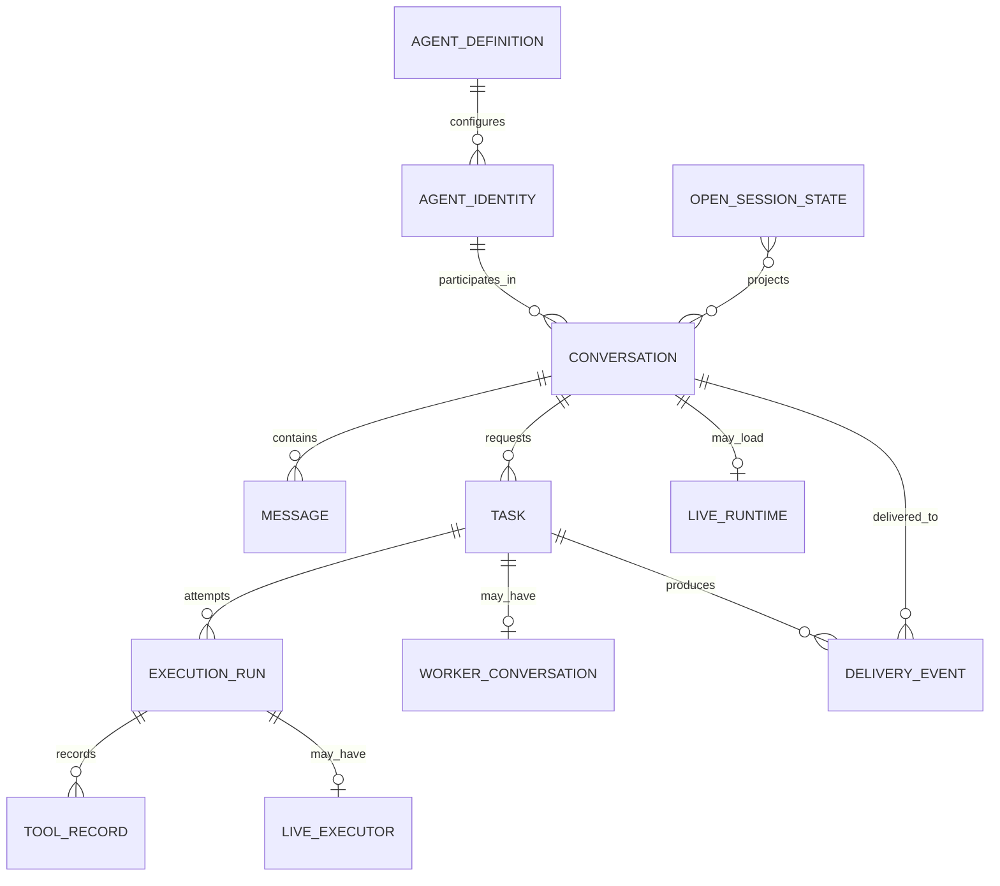

# Runtime ontology

This is a design vocabulary for the next phase, not an approved storage schema. “Current representation” documents today’s mapping; “target term” prevents new specifications from compounding existing ambiguity. Adopting the vocabulary does not by itself authorize refactoring code or data.

## Terms

| Target term | Meaning | Current representation | Required distinction |
|---|---|---|---|
| **Agent definition** | Durable, versionable configuration describing instructions, model choice, tools, and policy. | `AgentConfig` loaded from `agents/<name>.md`; synthetic worker configs are built in memory. | Definition identity/version must be separate from display name and from a live agent invocation. |
| **Agent identity** | Optional durable identity for an actor that can retain continuity across conversations or definition revisions. | No first-class record; `agentName` or a synthetic `worker-<taskId>` name is used contextually. | The design must decide whether persistent actor identity is needed; it must not emerge accidentally from filenames or config names. |
| **Conversation** | Durable user-visible thread containing messages and requested work. | A non-`worker-*` `SessionData` JSON file. | A conversation is not a loaded runtime and is not itself a delegated task. |
| **Message** | Durable conversation record authored by user, assistant, system, or tool. | `Message` embedded in `SessionData.messages`; timestamp optional, no message ID. | Message identity/order should not be inferred only from array position when events need durable references. |
| **Task** | Durable unit of requested work with parent conversation, status, and desired outcome. | Top-level sessions receive an otherwise unexplained random `taskId`; delegated work uses a meaningful UUID `taskId`. | User conversation identity and task identity must not be interchangeable. A task may have multiple execution attempts. |
| **Execution run** | One bounded attempt to execute an agent against a task or delivery wake. | An invocation of `Agent.run()` inside `SessionRuntime.runOnce()` or `Worker.run()`; not assigned an ID or stored as a first-class record. | Run outcome, start/end, model, input snapshot, and retry relation belong to the attempt, not the whole conversation. |
| **Live runtime** | In-memory serializer/coordinator loaded for one conversation. | `SessionRuntime` cached in `SessionManager.runtimes`. | Runtime lifetime is process-local and must not define whether the conversation exists. |
| **Live executor** | Ephemeral process object performing one run and accepting cancellation. | `Agent`, `Worker`, promise, and `AbortController`. | Losing the executor must leave a reconcilable durable run/task state. |
| **Worker conversation** | Optional transcript view showing a delegated task’s work. | `worker-<taskId>.json` using `SessionData`. | It is a projection/child record, not the task or executor itself; its relation should be explicit rather than filename-derived. |
| **Tool record** | Auditable tool request/result associated with a run. | Assistant `toolCalls` and later `tool` messages joined by `toolCallId`; live tool events are transient. | Tool records need a run association and stable ordering if used for recovery/audit. |
| **Delivery event** | Durable notification that a child task reached a terminal outcome for a parent conversation. | `PendingMessage` in `<sessionId>.mailbox.jsonl`, later converted to a system message. | Event identity, delivery/ack state, and idempotency should be explicit. |
| **Open-session state** | Server-owned user-interface projection of open and active conversations. | `.harness/open-sessions.json`, mirrored by `RuntimeSync` and `useSessionStore`. | Opening a tab, loading a runtime, and executing a wake are separate operations. |
| **Activity projection** | Non-authoritative UI view of running state, tool activity, and worker roster. | `useRuntimeStore` and `useRosterStore`. | It should be rebuildable from durable run/task facts after reconnect. |

## Current naming collisions

- `SessionData` represents both conversations and worker transcripts.
- `sessionId` can mean a user conversation ID or a derived worker transcript ID.
- `taskId` is assigned to every top-level conversation and also identifies actual delegated work.
- `Agent` means one live model/tool loop, while an agent markdown file is effectively a persistent definition and `agentName` is used as its identity.
- `completedAt`/`result` on a top-level session describe the latest delivery run even though the conversation may continue.
- “Inbox” can mean the human knowledge-inbox filesystem, the process-local `MessageBus` inbox, or the durable worker-completion mailbox. New work should always qualify which one.

“Session” is therefore a legacy/API term pending design. A future spec must choose whether it means a conversation, a durable execution context beneath a conversation, or only a live runtime lease; it must not continue to mean all three.

## Lifecycle vocabulary

Specifications should describe transitions independently for task and run:

- Task: `requested` → `queued` → `active` → `succeeded | failed | cancelled | abandoned`.
- Run: `created` → `started` → `succeeded | failed | cancelled | interrupted`.
- Delivery: `pending` → `materialized` → `acknowledged`, with idempotent recovery from any persisted boundary.

These labels are proposals to validate in a design spec. In particular, retry policy, who may mark `abandoned`, and whether acknowledgement is required are undecided.

## Identity rules for future specs

1. Never derive durable identity from a mutable display name.
2. Never derive parentage solely from `worker-` string prefixes.
3. Include an explicit schema version in new durable record families.
4. Record parent/child/task/run relationships directly.
5. Decide idempotency keys and uniqueness scopes before defining write APIs.
6. Keep provider credentials and live cancellation handles outside durable public records.
7. Treat the existing JSON files as migration inputs, not as proof that the target must remain file-based.

## Questions deliberately left open

- Is a worker transcript a child conversation, a view over run events, or optional debug output?
- Can a task have multiple concurrent attempts, or only sequential retries?
- What is the acknowledgement boundary for a completion: durable transcript materialization, successful wake run, or user presentation?
- Which task/run states must survive a process crash, and which work is safe to retry automatically?
- Does an agent definition change affect an existing conversation immediately, or does each run pin a definition revision?
- Which identity and lifecycle events must be exposed through REST, WebSocket, or both?

The next design phase must answer these before selecting a persistence schema or performing a migration.
