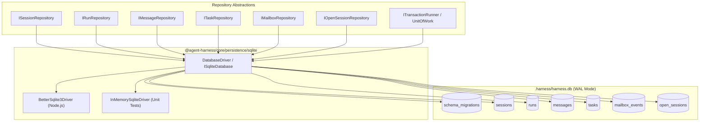

# Persistence and ACID Transactions Specification

Status: Approved
Governing ADR: `docs/decisions/0004-acid-storage-and-relational-persistence.md`

## Problem and evidence

Currently, Agent Harness relies on loose files on the filesystem for persistence: session transcripts (`.json`), worker mailboxes (`.jsonl`), metadata indexes (`.index.json`), and open session states (`.harness/open-sessions.json`).

1. **Non-Atomic Mailbox Drain**: Draining worker completion events from a mailbox into a session transcript requires two separate writes. A process termination between the transcript save and the mailbox acknowledgment relies on a "materialize-before-acknowledge" heuristic to avoid message loss, but leaves orphaned files and potential duplicate reconciliation requirements.
2. **Orphaned In-Flight Tasks**: In-flight background workers are tracked via in-memory `AbortController` instances in `SessionManager`. On a server restart or crash, these executions vanish from memory, leaving tasks permanently stuck in `running` status without diagnostic resolution.
3. **Index Drift**: Collection listing relies on scanning directory files or an eventually consistent `.index.json` projection that can become desynchronized upon concurrent operations or unexpected termination.
4. **Ambiguous Data Models**: User sessions and worker traces share an ambiguous `SessionData` structure differentiated only by `worker-` naming prefixes, violating runtime ontology boundaries (`docs/architecture/RUNTIME_ONTOLOGY.md`).

## Goals and non-goals

### Goals
- Provide full ACID (Atomicity, Consistency, Isolation, Durability) guarantees using embedded SQLite with Write-Ahead Logging (WAL) mode at `.harness/harness.db`.
- Execute mailbox event draining (pop pending completions + append system messages to conversation + append user prompt) in a single atomic `BEGIN IMMEDIATE` transaction.
- Implement strongly typed relational tables for `schema_migrations`, `sessions`, `runs`, `messages`, `tasks`, `mailbox_events`, and `open_sessions`.
- Implement a startup worker reconciliation protocol that transitions orphaned running tasks to `abandoned` status and queues a diagnostic delivery for parent sessions.
- Provide a robust versioned schema migration runner with forward and backward compatibility and SHA-256 checksum verification.
- Provide an automated, zero-data-loss legacy migration pipeline that discovers, validates, backs up, and imports existing JSON/JSONL session data into SQLite, quarantining corrupted records to `.invalid-<timestamp>-<uuid>`.
- Achieve high-performance metadata queries (`GET /api/sessions/meta` < 10ms for 10,000 sessions) via B-tree indexing.

### Non-goals
- Multi-process distributed database clustering (Agent Harness is an embedded, single-host orchestrator).
- Direct external SQL access from client dashboard (dashboard communicates strictly via validated REST/WebSocket APIs).
- Removing backward-compatible JSON export/import utilities.

## Architectural Design



## Required behavior

### 1. Database Initialization & Configuration

The SQLite database engine initializes at `.harness/harness.db` (or `:memory:` for isolated unit tests) and executes the following pragmas on every connection:

```sql
PRAGMA journal_mode = WAL;
PRAGMA synchronous = NORMAL;
PRAGMA foreign_keys = ON;
PRAGMA busy_timeout = 5000;
PRAGMA cache_size = -64000;
PRAGMA mmap_size = 268435456;
PRAGMA temp_store = MEMORY;
```

#### Pragma Semantics:
- **`journal_mode = WAL`**: Write-Ahead Logging allows concurrent non-blocking readers alongside writers.
- **`synchronous = NORMAL`**: Fsyncs WAL at checkpoints rather than on every commit, ensuring ACID durability without disk I/O bottlenecks.
- **`foreign_keys = ON`**: Enforces relational integrity and cascading deletes.
- **`busy_timeout = 5000`**: Automatically retries for up to 5,000ms on write lock contention before returning `SQLITE_BUSY`.
- **`cache_size = -64000`**: Allocates 64 MiB page cache in RAM per connection.
- **`mmap_size = 268435456`**: Configures 256 MiB memory-mapped I/O for direct OS page cache access.
- **`temp_store = MEMORY`**: Keeps temporary sort tables and indices in RAM.

#### WAL Checkpointing Strategy:
- **Auto Checkpoint**: `PRAGMA wal_autocheckpoint = 1000` (checkpoints when WAL reaches 1,000 pages / ~4 MiB).
- **Idle Checkpoint**: Periodic background timer triggers `PRAGMA wal_checkpoint(PASSIVE)` after 10s of write inactivity.
- **Shutdown Checkpoint**: During process termination, executes `PRAGMA wal_checkpoint(TRUNCATE)` to reset WAL size to 0 bytes and remove temporary `-shm` files.

---

### 2. Relational Schema Architecture (Migration `0001_initial_schema.sql`)

```sql
-- Schema Migrations Table
CREATE TABLE IF NOT EXISTS schema_migrations (
  version INTEGER PRIMARY KEY,
  name TEXT NOT NULL,
  applied_at INTEGER NOT NULL,
  checksum TEXT NOT NULL
);

-- Sessions Table (Durable Conversation Root)
CREATE TABLE IF NOT EXISTS sessions (
  id TEXT PRIMARY KEY,
  agent_name TEXT NOT NULL,
  title TEXT,
  prompt TEXT NOT NULL,
  created_at INTEGER NOT NULL,
  updated_at INTEGER NOT NULL,
  completed_at INTEGER,
  metadata TEXT, -- Validated JSON object
  CONSTRAINT chk_session_id_nonempty CHECK (length(id) > 0),
  CONSTRAINT chk_agent_name_nonempty CHECK (length(agent_name) > 0)
);

CREATE INDEX IF NOT EXISTS idx_sessions_updated_at ON sessions(updated_at DESC);
CREATE INDEX IF NOT EXISTS idx_sessions_created_at ON sessions(created_at DESC);
CREATE INDEX IF NOT EXISTS idx_sessions_agent_name ON sessions(agent_name);

-- Runs Table (Bounded Execution Invocations)
CREATE TABLE IF NOT EXISTS runs (
  run_id TEXT PRIMARY KEY,
  session_id TEXT NOT NULL REFERENCES sessions(id) ON DELETE CASCADE,
  request_id TEXT,
  status TEXT NOT NULL CHECK (status IN ('queued', 'running', 'completed', 'failed', 'cancelled', 'interrupted')),
  started_at INTEGER NOT NULL,
  completed_at INTEGER,
  model TEXT,
  token_usage TEXT, -- Validated JSON: { promptTokens, completionTokens, totalTokens, cachedTokens }
  error_code TEXT,
  error_message TEXT,
  CONSTRAINT chk_run_completed_after_started CHECK (completed_at IS NULL OR completed_at >= started_at)
);

CREATE INDEX IF NOT EXISTS idx_runs_session_started ON runs(session_id, started_at ASC);
CREATE INDEX IF NOT EXISTS idx_runs_status ON runs(status);

-- Messages Table (Ordered Transcript with Total Ordering)
CREATE TABLE IF NOT EXISTS messages (
  id TEXT PRIMARY KEY,
  session_id TEXT NOT NULL REFERENCES sessions(id) ON DELETE CASCADE,
  run_id TEXT REFERENCES runs(run_id) ON DELETE SET NULL,
  role TEXT NOT NULL CHECK (role IN ('user', 'assistant', 'system', 'tool')),
  content TEXT NOT NULL,
  reasoning TEXT,
  tool_calls TEXT, -- Validated JSON Array of ToolCall
  tool_call_id TEXT,
  sequence_num INTEGER NOT NULL,
  created_at INTEGER NOT NULL,
  metadata TEXT, -- Validated JSON: { meta?: unknown }
  CONSTRAINT uq_session_sequence UNIQUE (session_id, sequence_num),
  CONSTRAINT chk_sequence_num_nonnegative CHECK (sequence_num >= 0)
);

CREATE INDEX IF NOT EXISTS idx_messages_session_seq ON messages(session_id, sequence_num ASC);
CREATE INDEX IF NOT EXISTS idx_messages_run_id ON messages(run_id);
CREATE INDEX IF NOT EXISTS idx_messages_tool_call_id ON messages(tool_call_id) WHERE tool_call_id IS NOT NULL;

-- Tasks Table (Delegated Background Worker Tasks)
CREATE TABLE IF NOT EXISTS tasks (
  task_id TEXT PRIMARY KEY,
  parent_session_id TEXT NOT NULL REFERENCES sessions(id) ON DELETE CASCADE,
  worker_session_id TEXT UNIQUE REFERENCES sessions(id) ON DELETE CASCADE,
  description TEXT NOT NULL,
  status TEXT NOT NULL CHECK (status IN ('queued', 'running', 'completed', 'failed', 'cancelled', 'abandoned')),
  created_at INTEGER NOT NULL,
  updated_at INTEGER NOT NULL,
  completed_at INTEGER,
  error_code TEXT,
  error_message TEXT,
  CONSTRAINT chk_task_completed_after_created CHECK (completed_at IS NULL OR completed_at >= created_at)
);

CREATE INDEX IF NOT EXISTS idx_tasks_parent_status ON tasks(parent_session_id, status);
CREATE INDEX IF NOT EXISTS idx_tasks_worker ON tasks(worker_session_id);
CREATE INDEX IF NOT EXISTS idx_tasks_status ON tasks(status);

-- Mailbox Events Table (Durable Completion Deliveries)
CREATE TABLE IF NOT EXISTS mailbox_events (
  id INTEGER PRIMARY KEY AUTOINCREMENT,
  parent_session_id TEXT NOT NULL REFERENCES sessions(id) ON DELETE CASCADE,
  task_id TEXT NOT NULL REFERENCES tasks(task_id) ON DELETE CASCADE,
  event_type TEXT NOT NULL DEFAULT 'worker_completed' CHECK (event_type IN ('worker_completed', 'worker_abandoned', 'diagnostic')),
  payload TEXT NOT NULL, -- Validated JSON: PendingMessage
  status TEXT NOT NULL CHECK (status IN ('pending', 'acknowledged', 'rejected')),
  created_at INTEGER NOT NULL,
  acknowledged_at INTEGER,
  CONSTRAINT uq_parent_task_event UNIQUE (parent_session_id, task_id)
);

CREATE INDEX IF NOT EXISTS idx_mailbox_pending_drain ON mailbox_events(parent_session_id, status, id ASC);
CREATE INDEX IF NOT EXISTS idx_mailbox_task ON mailbox_events(task_id);

-- Open Sessions Table (Tab Projection State)
CREATE TABLE IF NOT EXISTS open_sessions (
  session_id TEXT PRIMARY KEY REFERENCES sessions(id) ON DELETE CASCADE,
  tab_order INTEGER NOT NULL UNIQUE,
  is_active INTEGER NOT NULL CHECK (is_active IN (0, 1)),
  CONSTRAINT chk_tab_order_nonnegative CHECK (tab_order >= 0)
);

CREATE INDEX IF NOT EXISTS idx_open_sessions_tab_order ON open_sessions(tab_order ASC);
```

---

### 3. Transactional Mailbox Drain Protocol

When `SessionRuntime.deliver()` runs:

```mermaid
sequenceDiagram
    autonumber
    participant SR as SessionRuntime
    participant DB as SQLite Engine (WAL)
    participant MB as mailbox_events
    participant MSG as messages
    participant SESS as sessions

    SR->>DB: BEGIN IMMEDIATE TRANSACTION
    Note over DB: Locks write access;<br/>concurrent reads proceed.

    SR->>MSG: SELECT COALESCE(MAX(sequence_num), -1) AS max_seq WHERE session_id = ?
    MSG-->>SR: max_seq (e.g. 5)

    SR->>MB: SELECT * FROM mailbox_events WHERE parent_session_id = ? AND status = 'pending' ORDER BY id ASC
    MB-->>SR: Pending worker completions [evt_101, evt_102]

    loop For each unmaterialized pending event
        SR->>MSG: INSERT INTO messages (id, session_id, role='system', content='[Worker Completed]...', sequence_num=6, ...)
        SR->>MB: UPDATE mailbox_events SET status='acknowledged', acknowledged_at=? WHERE id=101
    end

    opt If new User Message present in delivery
        SR->>MSG: INSERT INTO messages (id, session_id, role='user', content='...', sequence_num=7, ...)
    end

    SR->>SESS: UPDATE sessions SET updated_at = ? WHERE id = ?

    alt All operations succeed
        SR->>DB: COMMIT
        Note over DB: Drained mailbox & messages<br/>materialized atomically!
    else Any failure occurs
        SR->>DB: ROLLBACK
        Note over DB: Zero partial messages saved;<br/>mailbox stays 'pending'.
    end
```

#### Protocol Details:
1. Opens an immediate write transaction (`BEGIN IMMEDIATE`).
2. Calculates `currentSeq = COALESCE(MAX(sequence_num), -1) + 1` from `messages` for `session_id`.
3. Fetches all pending records from `mailbox_events` for `parent_session_id` ordered by `id ASC`.
4. Materializes system messages into `messages` with monotonic sequence numbers and marks each `mailbox_event` as `acknowledged`.
5. If a new user message is provided, inserts it with `sequence_num = currentSeq + 1`.
6. Updates `sessions.updated_at`.
7. Executes `COMMIT`. If any query fails, `ROLLBACK` executes, guaranteeing that either all completions are materialized and acknowledged, or none are.

---

### 4. Legacy Data Migration Pipeline

```
+-----------------------------------------------------------------------------------+
|                            Legacy Migration Pipeline                              |
+-----------------------------------------------------------------------------------+
|                                                                                   |
| 1. Discovery & Pre-flight Scan                                                    |
|    - Scan <sessionsDir>/*.json, *.mailbox.jsonl, .index.json, open-sessions.json  |
|    - If no legacy files exist, exit immediately (zero overhead on clean installs) |
|                                                                                   |
| 2. Snapshot & Pre-Migration Backup                                                |
|    - Create .harness/legacy_backup_<timestamp>_<uuid>/                            |
|    - Copy all legacy files into backup directory with file attribute preservation |
|                                                                                   |
| 3. Parse, Validate & Quarantine                                                   |
|    - Parse files against Zod schemas (SessionDataSchema, PendingMessageSchema)    |
|    - If corrupted/invalid: quarantine to <file>.invalid-<timestamp>-<uuid>        |
|    - Record structured diagnostic warnings in migration report                    |
|                                                                                   |
| 4. Relational Transformation & Atomic Batch Load                                  |
|    - Transform validated structures into relational records                       |
|    - BEGIN IMMEDIATE transaction in SQLite                                        |
|    - Insert into sessions, runs, messages, tasks, mailbox_events, open_sessions   |
|    - COMMIT transaction                                                           |
|                                                                                   |
| 5. Post-Migration Verification & Integrity Check                                  |
|    - Execute PRAGMA integrity_check and PRAGMA foreign_key_check                  |
|    - Verify row count parity against parsed in-memory entities                    |
|                                                                                   |
| 6. Finalization / Safe Rollback                                                   |
|    - On Success: Archive original legacy files, record migration marker           |
|    - On Failure: ROLLBACK, remove partial harness.db, restore legacy files        |
+-----------------------------------------------------------------------------------+
```

#### Quarantine and Fallback Rules:
- If a legacy transcript or mailbox file fails validation, it is moved to `<file>.invalid-<timestamp>-<uuid>`.
- A diagnostic record is appended to structured logs and `.harness/migration_diagnostics.json`.
- Valid sessions continue migrating without being blocked by an individual corrupted file.

---

### 5. Startup Worker Reconciliation Protocol

During server initialization in `SessionManager.initialize()`, before opening network listeners:

```sql
SELECT t.task_id, t.parent_session_id, t.worker_session_id, t.description, t.created_at,
       s.agent_name as worker_agent_name
FROM tasks t
LEFT JOIN sessions s ON t.worker_session_id = s.id
WHERE t.status IN ('running', 'queued');
```

For every orphaned task:
1. Update `tasks SET status = 'abandoned', completed_at = ?, updated_at = ? WHERE task_id = ?`.
2. Insert a diagnostic event into `mailbox_events`:
   ```json
   {
     "taskId": "task-123",
     "from": "worker-task-123",
     "agentName": "worker",
     "status": "error",
     "summary": "Task was abandoned due to an ungraceful server termination or process crash.",
     "receivedAt": "2026-08-18T20:25:00.000Z"
   }
   ```
3. When the parent session is opened or waked, `SessionRuntime.deliver()` drains the diagnostic event and presents the failure card cleanly to the user.

---

## Acceptance criteria

1. **ACID Transaction Tests**:
   - Simulated process crash, mid-turn thrown errors, or disk full errors leave zero uncommitted messages and preserve all mailbox items as `pending`.
   - Concurrent calls to `deliver()` on the same session execute sequentially without database lock contention errors.
2. **Crash Recovery & Reconciliation**:
   - Interrupted tasks in `running` state are reconciled to `abandoned` on boot, producing an informative notice in the parent session transcript upon next wake.
3. **Migration Integrity**:
   - Automated migration imports all legacy `.json` and `.mailbox.jsonl` files from existing workspaces into `harness.db` with 100% entity and byte fidelity.
   - Corrupted legacy files are quarantined with zero data loss to valid records.
4. **Performance & Concurrency**:
   - `GET /api/sessions/meta` responds in `< 10ms` for 10,000 sessions using indexed relational queries.
   - 50 concurrent transactions complete with zero unhandled `SQLITE_BUSY` errors using `withDbRetry`.
5. **Bidirectional Migration**:
   - Forward migration `0001_initial_schema.sql` and rollback `0001_initial_schema.down.sql` leave the database in an exact matched baseline state.

---

## Open questions and decisions

- **Governing ADR**: `docs/decisions/0004-acid-storage-and-relational-persistence.md`.
- **Database Driver**: Standardize on `better-sqlite3` for Node.js runtime, abstracted via `ISqliteDatabase` / `IDatabaseDriver` to allow in-memory unit tests and edge/WASM drivers (`@libsql/client`).
